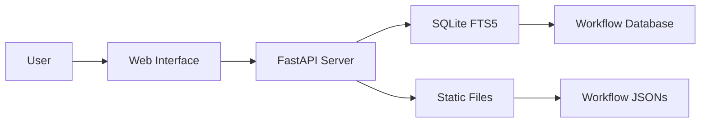

# n8n Workflow Collection

<div align="center">


[](https://www.buymeacoffee.com/zie619)

### The Ultimate Collection of n8n Automation Workflows

**[Browse Online](https://zie619.github.io/n8n-workflows)** · **[Documentation](#documentation)** · **[Contributing](#contributing)** · **[License](#license)**

</div>

---

<div align="center">

<a href="https://github.com/Trusera/ai-bom">
  
</a>

<h2>NEW: Scan Your n8n Workflows for AI Security Risks</h2>

<a href="https://github.com/Trusera/ai-bom">
  
</a>
<a href="https://github.com/Trusera/ai-bom">
  
</a>
<a href="https://github.com/Trusera/ai-bom">
  
</a>

</div>

<table>
<tr>
<td width="65%">

### Your workflows contain AI — do you know what's hiding in them?

We built **[AI-BOM](https://github.com/Trusera/ai-bom)** because we scanned our own 4,343 workflows and found **hardcoded API keys, unauthenticated AI agents, and MCP clients connecting to unknown servers** — all invisible to existing security tools.

**AI-BOM is the first and only tool that scans n8n workflows for AI security risks.**

```bash
pip install ai-bom
ai-bom scan ./workflows/
```

One command finds every AI Agent node, LLM integration, MCP client, hardcoded credential, and dangerous tool combination — then gives you a risk score and a compliance-ready report.

**EU AI Act deadline: August 2025.** You need an AI inventory.

<a href="https://github.com/Trusera/ai-bom"><strong>Get AI-BOM (free & open source) &rarr;</strong></a>

</td>
<td width="35%" align="center">

<a href="https://github.com/Trusera/ai-bom">
  
</a>

<br />

<sub><strong>AI-BOM</strong> by <a href="https://trusera.dev">Trusera</a></sub>
<br />
<sub>Securing the Agentic Service Mesh</sub>

</td>
</tr>
</table>

<details>
<summary><strong>What does AI-BOM detect in n8n workflows? (click to expand)</strong></summary>

<br />

| Risk | Severity | What it finds |
|------|----------|---------------|
| **AI Agent nodes** | CRITICAL | Agents connected to LLMs with tool access — can execute code |
| **Hardcoded credentials** | CRITICAL | API keys in workflow JSON instead of credential store |
| **Dangerous tool combos** | CRITICAL | Agents with Code Execution + HTTP Request = RCE risk |
| **MCP clients** | HIGH | Model Context Protocol connections to external servers |
| **Unauthenticated webhooks** | HIGH | Webhook triggers exposed to the internet without auth |
| **Agent chains** | HIGH | Execute Workflow linking agents without input validation |

Beyond n8n, AI-BOM also scans **source code** (Python, JS, TS, Java, Go, Rust, Ruby), **Docker configs**, **cloud infrastructure** (Terraform, CloudFormation), and **network endpoints** — 21+ AI SDKs detected across 7 languages.

Output formats: **CycloneDX SBOM** | **SARIF** (GitHub Code Scanning) | **HTML Dashboard** | **Markdown** | **JSON**

</details>

---

## What's New

### Latest Updates (November 2025)
- **Enhanced Security**: Full security audit completed, all CVEs resolved
- **Docker Support**: Multi-platform builds for linux/amd64 and linux/arm64
- **GitHub Pages**: Live searchable interface at [zie619.github.io/n8n-workflows](https://zie619.github.io/n8n-workflows)
- **Performance**: 100x faster search with SQLite FTS5 integration
- **Modern UI**: Completely redesigned interface with dark/light mode

---

## Quick Access

### Use Online (No Installation)
Visit **[zie619.github.io/n8n-workflows](https://zie619.github.io/n8n-workflows)** for instant access to:
- **Smart Search** — Find workflows instantly
- **15+ Categories** — Browse by use case
- **Mobile Ready** — Works on any device
- **Direct Downloads** — Get workflow JSONs instantly

---

## Features

<table>
<tr>
<td width="50%">

### By The Numbers
- **4,343** Production-Ready Workflows
- **365** Unique Integrations
- **29,445** Total Nodes
- **15** Organized Categories
- **100%** Import Success Rate

</td>
<td width="50%">

### Performance
- **< 100ms** Search Response
- **< 50MB** Memory Usage
- **700x** Smaller Than v1
- **10x** Faster Load Times
- **40x** Less RAM Usage

</td>
</tr>
</table>

---

## Local Installation

### Prerequisites
- Python 3.9+
- pip (Python package manager)
- 100MB free disk space

### Quick Start
```bash
# Clone the repository
git clone https://github.com/Zie619/n8n-workflows.git
cd n8n-workflows

# Install dependencies
pip install -r requirements.txt

# Start the server
python run.py

# Open in browser
# http://localhost:8000
```

### Docker Installation
```bash
# Using Docker Hub
docker run -p 8000:8000 zie619/n8n-workflows:latest

# Or build locally
docker build -t n8n-workflows .
docker run -p 8000:8000 n8n-workflows
```

---

## Documentation

### API Endpoints

| Endpoint | Method | Description |
|----------|--------|-------------|
| `/` | GET | Web interface |
| `/api/search` | GET | Search workflows |
| `/api/stats` | GET | Repository statistics |
| `/api/workflow/{id}` | GET | Get workflow JSON |
| `/api/categories` | GET | List all categories |
| `/api/export` | GET | Export workflows |

### Search Features
- **Full-text search** across names, descriptions, and nodes
- **Category filtering** (Marketing, Sales, DevOps, etc.)
- **Complexity filtering** (Low, Medium, High)
- **Trigger type filtering** (Webhook, Schedule, Manual, etc.)
- **Service filtering** (365+ integrations)

---

## Architecture



### Tech Stack
- **Backend**: Python, FastAPI, SQLite with FTS5
- **Frontend**: Vanilla JS, Tailwind CSS
- **Database**: SQLite with Full-Text Search
- **Deployment**: Docker, GitHub Actions, GitHub Pages
- **Security**: Trivy scanning, CORS protection, Input validation

---

## Repository Structure

```
n8n-workflows/
├── workflows/           # 4,343 workflow JSON files
│   └── [category]/     # Organized by integration
├── docs/               # GitHub Pages site
├── src/                # Python source code
├── scripts/            # Utility scripts
├── api_server.py       # FastAPI application
├── run.py              # Server launcher
├── workflow_db.py      # Database manager
└── requirements.txt    # Python dependencies
```

---

## Contributing

We love contributions! Here's how you can help:

### Ways to Contribute
- **Report bugs** via [Issues](https://github.com/Zie619/n8n-workflows/issues)
- **Suggest features** in [Discussions](https://github.com/Zie619/n8n-workflows/discussions)
- **Improve documentation**
- **Submit workflow fixes**
- **Star the repository**

### Development Setup
```bash
# Fork and clone
git clone https://github.com/YOUR_USERNAME/n8n-workflows.git

# Create branch
git checkout -b feature/amazing-feature

# Make changes and test
python run.py --debug

# Commit and push
git add .
git commit -m "feat: add amazing feature"
git push origin feature/amazing-feature

# Open PR
```

---

## Security

### Security Features
- Path traversal protection
- Input validation & sanitization
- CORS protection
- Rate limiting
- Docker security hardening
- Non-root container user
- Regular security scanning

### Reporting Security Issues
Please report security vulnerabilities to the maintainers via [Security Advisory](https://github.com/Zie619/n8n-workflows/security/advisories/new).

---

## License

This project is licensed under the MIT License - see the [LICENSE](LICENSE) file for details.

---

## Support

If you find this project helpful, please consider:

<div align="center">

[](https://www.buymeacoffee.com/zie619)
[](https://github.com/Zie619/n8n-workflows)

</div>

---

<div align="center">


</div>

---

<div align="center">

**Star us on GitHub — it motivates us a lot!**

Made with care by [Zie619](https://github.com/Zie619) and [contributors](https://github.com/Zie619/n8n-workflows/graphs/contributors)

<br />

<a href="https://github.com/Trusera/ai-bom">
  
</a>

**[AI-BOM](https://github.com/Trusera/ai-bom)** — Discover every AI agent, model, and API hiding in your infrastructure.
<br />
Open source by **[Trusera](https://trusera.dev)** — Securing the Agentic Service Mesh.

</div>
